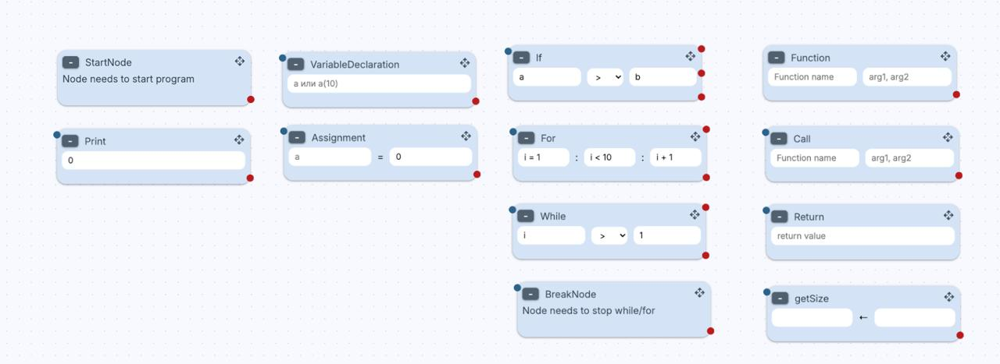
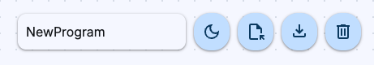

# CodeBlocks 

Визуальный редактор алгоритмов с собственным интерпретатором. Позволяет собирать программы из функциональных блоков, запускать их в реальном времени и отлаживать по шагам.

https://artferchelovek.github.io/hits-codeblock/



## Стек технологий

*   **Frontend**: [React](https://react.dev/) + [TypeScript](https://www.typescriptlang.org/)
*   **Сборка**: [Vite](https://vitejs.dev/)
*   **Drag & Drop**: [@dnd-kit/core](https://dnd-kit.com/)
*   **Стилизация**: **Vanilla CSS** с использованием переменных **Material 3 Design**. Поддержка темных и светлых тем.
*   **Архитектура**: Разделенные контексты (Program, Interaction, Compile) для высокой производительности и чистоты кода.
*   **Инфраструктура**: [Docker](https://www.docker.com/) (Multi-stage build) + Nginx.

## Примеры программ

В папке `examples/` вы найдете готовые алгоритмы, которые можно загрузить в редактор через кнопку "Upload" в тулбаре:


*   **[bubbleSort.json](./examples/bubbleSort.json)**
*   **[mergeSort.json](./examples/MergeSort.json)**
*   **[binarySearch.json](./examples/BinarySearch.json)**
*   **[palindromCheck.json](./examples/PalindromeCheck.json)**
*   **[StringReverse.json](./examples/StringReverse.json)**


## Как работает интерпретатор

1.  **Парсинг выражений**: Текстовые инпуты внутри блоков парсятся в абстрактное синтаксическое дерево (AST).
2.  **Генераторы (Step-by-step)**: Логика выполнения построена на **JavaScript Generators**. Это позволяет:
    *   Приостанавливать выполнение программы.
    *   Реализовать визуальную отладку (подсветка текущего блока).
    *   Выполнять программу по одному шагу.
3.  **Управление памятью**: Отдельный класс `VariableActions` отвечает за область видимости и хранение значений переменных.

## Как запустить

### С помощью Docker

Мы используем многоэтапную сборку, чтобы итоговый образ был максимально легким.

1.  Соберите образ:
    ```bash
    docker build -t codeblocks .
    ```
2.  Запустите контейнер:
    ```bash
    docker run -d -p 8080:80 codeblocks
    ```
    Приложение будет доступно по адресу `http://localhost:8080`.

### С помощью NPM

1.  Установите зависимости:
    ```bash
    npm install
    ```
2.  Запустите сервер для разработки:
    ```bash
    npm run dev
    ```
3.  Соберите проект для продакшена:
    ```bash
    npm run build
    ```

## Ключевые фичи

*   **Бесконечное поле**: Свободное перемещение (панорамирование) мышкой или тачем.
*   **Умный Зум**: Масштабирование поля (Ctrl + Scroll) точно в точку курсора.
*   **Динамические линии**: Связи между блоками пересчитываются в реальном времени с использованием оптимизированного `useEffect` и чтения DOM.
*   **Import/Export**: Сохраняйте свои алгоритмы в JSON и загружайте их обратно.
*   **Терминал**: Встроенный вывод для отслеживания работы программы.
*   **Dark Mode**: Адаптивный дизайн, который бережет ваши глаза.
